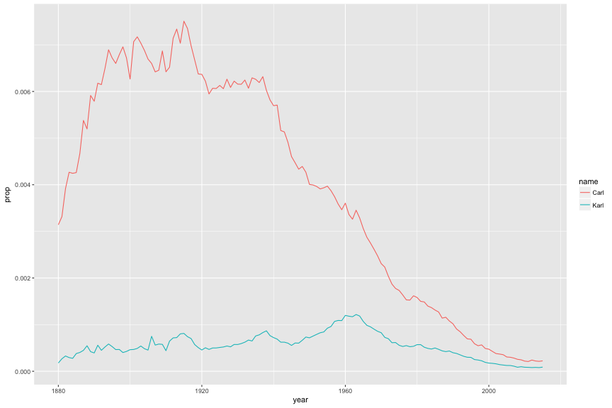

This is an illustration of an R script that can be treated like an
RMarkdown document using `knitr::spin()`.

To compile the document, use

    knitr::spin("2017_SISBID_3_05_bigjobs_activity1_spin.R")

This will create the result `2017_SISBID_3_05_bigjobs_activity1_spin.html`.

Let's first load some libraries. Note that I use `#+` with some
chunk options.


```r
library(babynames)
library(dplyr)
library(ggplot2)
```

Now let's grab the cases of "Karl" or "Carl" (and males only) from
the `babynames` dataset.


```r
karl <- babynames %>%
    filter(name=="Karl" | name=="Carl", sex=="M")
```

Now let's make a plot. I'll again use chunk options to adjust the size.


```r
karl %>% ggplot(aes(x=year, y=prop, color=name)) + geom_line()
```



